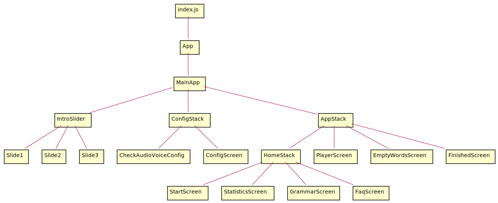
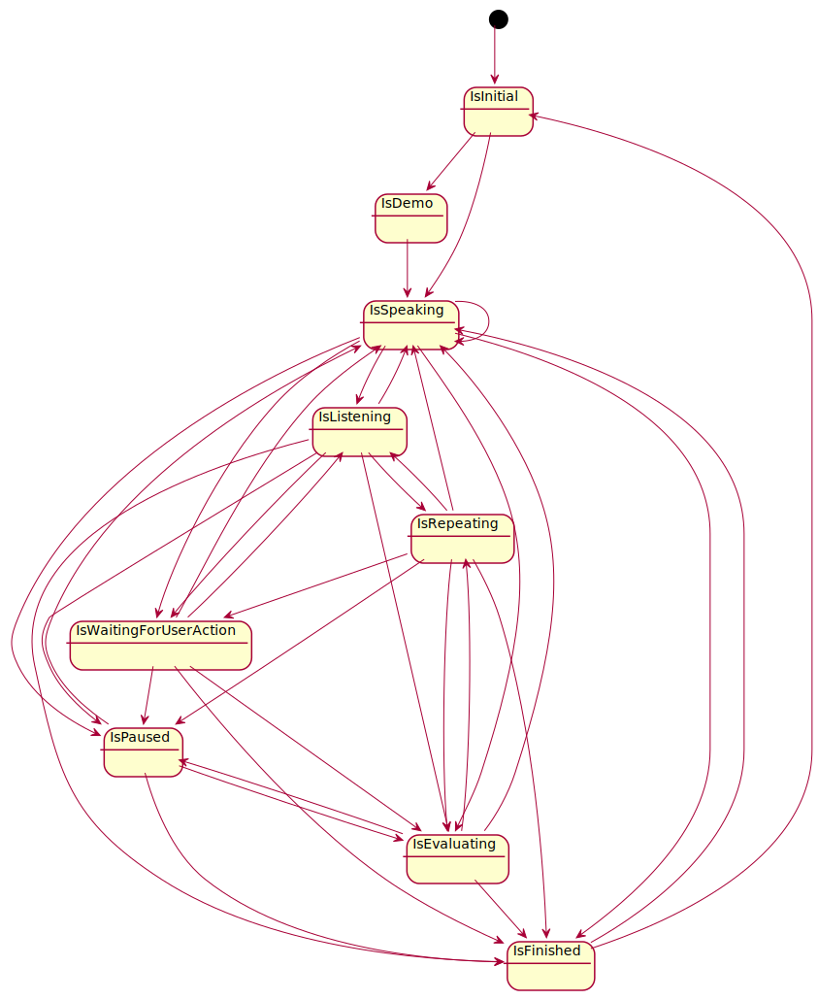

<h1 align="center">
  <br>

  <br>
  Articulus
  <br>
</h1>
<h4 align="center">An Audiobased Learning App for Android</h4>

- [React Native & TypeScript](#react-native---typescript)
- [App Structure, Screens & Entry Points](#app-structure--screens---entry-points)
- [Word Data](#word-data)
- [CDN with Statically and Github](#cdn-with-statically-and-github)
- [State Engine](#state-engine)
- [State Management with MobX](#state-management-with-mobx)
- [Speech-To-Text and Text-To-Speech](#speech-to-text-and-text-to-speech)
- [Animations](#animations)
- [Usage of SVG Files](#usage-of-svg-files)
- [Learning Algorithm](#learning-algorithm)
- [CD and CI with Bitrise](#cd-and-ci-with-bitrise)

## React Native & TypeScript

The Articulus app is a small pet project that was programmed with TypeScript, using React Native. Currently it is only tested on Android phones and available only on the Google Play Store. With little effort It should also be possible to run it on iOS though.

## App Structure, Screens & Entry Points



- The entry file for the app is [/index.js](./index.js)
- The entry component is [/components/App.tsx](./components/App.tsx)
- All components are stored in [/components/](./components) folder
- [MainApp](./components/MainApp.tsx) renders a _\<NavigationContainer />_ with [IntroSlider](./components/IntroSlider.tsx), [ConfigStack](./components/MainApp.tsx) & [AppStack](./components/MainApp.tsx)
- [ConfigStack](./components/MainApp.tsx) renders [CheckAudioVoiceConfig](./components/CheckAudioVoiceConfig.tsx) & [ConfigScreen](./components/ConfigScreen.tsx)
- [AppStack](./components/MainApp.tsx) navigates between [HomeStack](./components/MainApp.tsx), [PlayerScreen](./components/PlayerScreen.tsx), [FinishedScreen](./components/FinishedScreen.tsx) & [EmptyWordsScreen](./components/EmptyWordsScreen.tsx) by user interaction or LessonState change
- [HomeStack](./components/MainApp.tsx) renders a _\<Tab.Navigator />_ with the tabs [StartScreen](./components/StartScreen.tsx), [StatisticsScreen](./components/StatisticsScreen.tsx), [GrammarScreen](./components/GrammarScreen.tsx) & [FaqScreen](./components/FaqScreen.tsx)

## Word Data

Articulus is used to learn articles for the most common german words. Around 1000 german words were manually selected and added to [wordList.csv](./model/wordList.csv) file. The csv file has 4 columns:

- **word**
- **article**
- **source image URL** (chosen from the free images platform [pixabay](https://pixabay.com/))
- **grammar ruleId** (optional)

A manually triggered compilation step is necessary to convert the csv data to a format that can be used by the app:

```bash
$ cd model
$ node wordListToModel.ts > model.json
```

As a result, [model.json](./model/model.json) stores word objects in the following format:

```javascript
export interface WordType {
  value: string;
  slot: number;
  article: string;
  timestamp: Date;
  imageUrl: string;
  dueDateTime: Date;
  ruleId: string;
}
```

Example entry:

```javascript
{
   "value":"Ärger",
   "slot":0,
   "article":"der",
   "timestamp":null,
   "dueDateTime":null,
   "imageUrl":"https://cdn.statically.io/img/raw.githubusercontent.com/Leelu55/Articulus/master/model/images/boy-3617648__340.jpg",
   "ruleId":"FAQ_RULES_ER"
}
```

The [wordListToModel.ts](./model/wordListToModel.ts) script checks uniqueness and correctness of words and takes care of downloading images from Pixabay to the [/model/images/](./model/images) folder.

Additions and changes to the images folder have to be pushed to the Articulus GitHub repo to make the image files available to the [CDN](#cdn-with-statically-and-github).

The generated [model.json](./model/model.json) file is used in the MobX [WordsStore](./stores/WordsStore.ts) constructor to load the word data as a state into the app on initialization.

## Image CDN with Statically and Github

To reduce app size, heavy word image files can not be delivered with the app. Instead they are dynamically loaded from the internet whenever a word is shown within the app.

To deliver those images fast, Articulus relies on the [Statically CDN](https://statically.io) which in turn uses the Articulus GitHub repository as it's storage backend.

**So the following image...**


**...is linked inside the App like this:**

https://cdn.statically.io/img/raw.githubusercontent.com/Leelu55/Articulus/master/model/images/traffic-light-876056__340.jpg

**...and maps inside this GitHub Repo like this:**

https://github.com/Leelu55/Articulus/master/model/images/traffic-light-876056__340.jpg

For the current word image Statically checks if the imageis already in its cache. If so, it is delivered directly from cache, otherwise it's downloaded from Github Articulus repo.

## State Engine

The flow of the Articulus app is (partly) controlled by a simple state engine. It makes sure only valid state transitions happen:



Look inside the implementation of the state engine <a href="https://github.com/Leelu55/Articulus/blob/99ec9166bd0d1331d684998d30879f7bffea8528/stores/UIStore.ts#L6">here</a>, <a href="https://github.com/Leelu55/Articulus/blob/99ec9166bd0d1331d684998d30879f7bffea8528/stores/UIStore.ts#L19">here</a> and <a href="https://github.com/Leelu55/Articulus/blob/99ec9166bd0d1331d684998d30879f7bffea8528/stores/UIStore.ts#L128">here</a>.

## State Management with MobX

To provide and persist state for components, the state management library [MobX](https://mobx.js.org/README.html) is used:

```javascript
<Provider {...stores}>
  <MainApp />
  ...
</Provider>
```

The app state is split into two stores:

- [UIStore](./stores/UIStore.ts) for UI state including the state engine
- [WordsStore](./stores/WordsStore.ts) for app data state and keeping track of learning progress

## Speech-To-Text and Text-To-Speech

As an audiobased learning app Articulus supports voice commands as answers. During a lesson each displayed word is pronounced by the app using the <a href="https://github.com/ak1394/react-native-tts#speaking">React Native TTS library</a>.

The speech-to-text functionality was implemented using the <a href="https://github.com/react-native-voice/voice">React Native Voice library</a>.

The interaction of text-to-speech, speech-to-text and use input triggers and is being triggered by allowed state changes as determined by the state engine.

Listener methods for both libraries are configured inside [audioVoice.ts](./libs/audioVoice.ts).

**automatic and manual mode**
There are two modes to play a lesson: automatic and manual. Both modes allow spoken answers, but in automatic mode after spoken word the app listens for the vocal answer of the user. In manual mode to say the right article aloud, the microphone symbol has to be clicked.

**handling errors and evaluating results**
The built-in error handling of the voice recognition library is implemented to allow the user two more tries in case the answer was not eligable because of background noise, low volume or other problems. If there is a speech result, the custom[ extract article function](./libs/extractArticle.ts) checks if the answer

1. is not too long (maximum five words to reduce the time for checking the answer) and
2. includes an article ('der', 'die' or 'das').

If both conditions are met, it returns the article. The extracted article is then compared to the correct word article. Otherwise the word is again being repeated up to two times, then skipped.

## Animations

Animations were realized using both the built-in React Native [Animated](https://reactnative.dev/docs/animated) library and the [Reanimated](https://docs.swmansion.com/react-native-reanimated/) library.

A good example of Animation library use is the [AnimatedNumber](./components/AnimatedNumber.tsx) component used to create a count up animation in the [CatChatBubble](./components/FinishedScreen/CatChatBubble.tsx) on [FinishedScreen](./components/FinishedScreen/FinishedScreen.tsx). It animates the count up of correct and wrong answers of a lesson.

Reanimated was used for animating [HintBubbles](./components/HintBubble.tsx) for the tutorial view on initial lesson start.

## Usage of SVG Files

**Conversion of SVGs to React Native Component**

Articulus uses a bunch of nice Vector Graphics (SVGs), many of them taken from [freepik.com](https://www.freepik.com/). For use in the App, downloaded SVGs must be converted to RN Components first. We use an online tool called [react-svgr](https://react-svgr.com/playground/?native=true&typescript=true) to do so.

**Animating SVGs**

After converting an SVG to an ordinary RN Component, we can also apply complex RN Animations to those SVGs, like [here](./components/SVGs/UnicornCat.tsx), [here](./components/intro/Slide2.tsx) and [here](./components/intro/Slide3.tsx).

## Learning Algorithm

**Spaced repition learning**
Articulus implements a [spaced repition based algorithm](https://en.wikipedia.org/wiki/Leitner_system) for teaching german articles for the most common words. Words not answered correctly will reappear in the lesson more often, correctly answered ones will be repeated less frequently. Once a word article was chosen correctly, it moves up one learning level (slot 0-6). If answered wrongly, it moves down a level. Each word once answered gets a due date based on its slot and the current date.

**Implementation of the algorithm**
The algorithm is implemented in the [populateLesson](./libs/populateLesson.ts) function.
Each word starts out with slot 0. If there are no words with a due date corresponding to the current day, "new" words are being added from the pool up to the lesson size defined in the [settings](./libs/settings.json). Once a word reached final slot count (see [settings](./libs/settings.json)), it is considered learned and will not be included into lessons again.

**The due date calculation**
Due date is calculated woth the [updateDueDateTimeForWord](./stores/WordsStore.ts) action defined in WordsStore. It uses the slot as the power of 2 for calculating the number of days to add to current date.

For example a word with a slot of 1 will be repeated the day after tomorrow, a word with slot 4 already 16 days from today. The concrete date for the reappearance is computed using a bunch of [helper functions](./libs/dateMethods.ts) to deal with JS Date type issues.

```javascript
  @action updateDueDateTimeForWord = (value: string) => {
    const index = this.words.findIndex((word) => word.value === value);
    this.words[index].dueDateTime = dateMethods.articulusDateToJsDate(
      dateMethods.getFutureDate(Math.pow(2, this.words[index].slot)),
    );
  };

```

## Testing

Currently, there are only a handful of unit tests available, only for some of the most hairy parts of the app:

- [/libs/dateMethods.test.ts](./libs/dateMethods.test.ts)
- [/libs/extractArticle.test.ts](./libs/extractArticle.test.ts)
- [/libs/populateLesson.test.ts](./libs/populateLesson.test.ts)
- [/libs/utils.test.ts](./libs/utils.test.ts)

Although that's not nearly enough tests, the existing ones in conjunction with the [State Engine](#state-engine) make the Articulus development "feel" quiet stable at the moment.

Tests are run manually with `yarn test` or automatically during CI/CD.

## CD and CI with Bitrise

Articulus uses [bitrise.io](https://www.bitrise.io/) as its continuous delivery platform. The following workflow is configured to automatically deploy committed changes to the Play Store:

1. Activate the ssh-key
2. Clone Articulus git repository
3. Install dependencies with `npm install`
4. Run tests with `npm test`
5. Create typedoc documentation
6. Change Android version code and version name
7. Build Android release
8. Sign the APK
9. Deploy to Google Play
