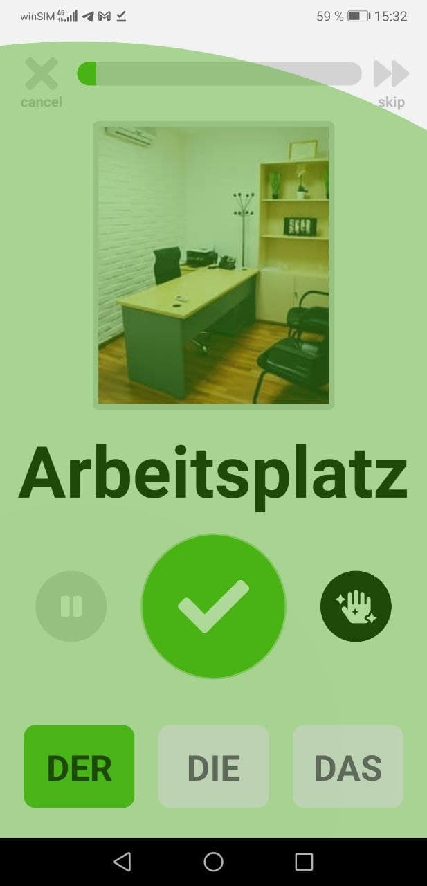
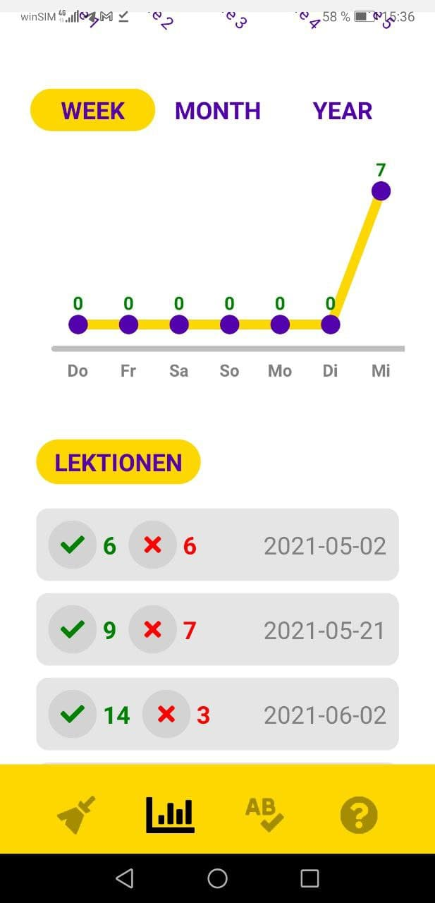

<h1 align="center">
  
  
  
  <h2 align="center">Learn <a>Der</a>, <a>Die</a>, <a>Das</a> the <u>easy way</u></h2>
</h1>

---

- Hands-free learning using Text-To-Speech and Speech-To-Text technology to enable voice-controlled lessons
- Grammar hints in lessons to improve language skills
- Learning with flash cards-based system, repeating correctly answered words in increasingly greater intervals. This learning method is based on the <a href="https://en.wikipedia.org/wiki/Spaced_repetition">spaced repetition</a> learning technique
- Statistics of learning progress, frequency and an overview of former lessons to increase learning motivation

---

  
  
   
  

---

  <a href="#install">Install</a> •
  <a href="#download">Download</a> •
  <a href="#credits">Credits</a> •
  <a href="#license">License</a>

---

## Articulus for Android

Install Articulus on your Android phone on the <a href="https://play.google.com/store/apps/details?id=com.derdiedas">Google Play Store</a>

## Git Clone to Contribute or Copy Cat

Articulus is an Open Source app built on top of React Native. Feel free to create pull requests to contribute to Articulus. Or even build your own App base on Articulus. Head over to the [Development Guide](./DEVELOP.md) to learn everything you need to know.

## Credits

- Thank you for all the :blue_heart: beautiful Icons made by <a href="https://www.freepik.com" title="Freepik">Freepik</a> from <a href="https://www.flaticon.com/" title="Flaticon">www.flaticon.com</a>

- The word images are all free images from <a href="https://pixabay.com/" title="Pixabay">Pixabay</a>.
  :pray: :heart_eyes_cat: to all the creators!

- Loading images :running: :running: :running: superfast was made possible with <a href="https://statically.io/">Statically</a> as CDN serving from the <a href="https://github.com/Leelu55/Articulus/tree/master/model/images">Articulus Github repo</a>

- State management was done with the :superhero: superpowers of <a href="https://mobx.js.org/README.html">MobX</a>

<b>Special thanks go out to the developers of:</b>

- <a href="https://reactjs.org/">React</a> and <a href="https://reactnative.dev/">React Native</a> for making mobile app development so much fun

- <a href="https://github.com/ak1394/react-native-tts">React Native TTS</a> and <a href="https://github.com/react-native-voice/voice">React Native Voice</a> for the Text-To-Speech and Speech-To-Text libraries

- <a href="https://github.com/FormidableLabs/victory-native"> Victory Native</a> for their great chart and data visualization components library

- <a href="https://github.com/react-native-svg/react-native-svg">react-native-svg</a> for SVG support library and <a href="https://github.com/gregberge/svgr">SVGR</a> for their SVG-to-JSX <a href="https://react-svgr.com/playground/">Playground</a>

- <a href="https://fontawesome.com/">Font Awesome</a> for their icon set

- <a href="https://github.com/software-mansion/react-native-reanimated">React Native Reanimated</a> for enabling really cool animations

## License

**[MIT Licensed](https://github.com/Leelu55/Articulus/blob/master/LICENSE)**
