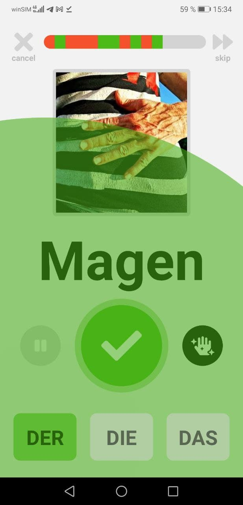

<h1 align="center">
  
  
  
  <h2 align="center">Learn <a href="https://de.wikipedia.org/wiki/Artikel_(Wortart)">Der</a>, <a href="https://de.wikipedia.org/wiki/Artikel_(Wortart)">Die</a>, <a href="https://de.wikipedia.org/wiki/Artikel_(Wortart)">Das</a> the <u>easiest way</u></h2>
</h1>

---

**Articulus** is **Learn Tech** aimed at **german** language learners that struggle with the german articles **Der Die Das**. It is **Open Source Software** and was built on top of **React Native**. It's **totally free**, **fun to use** and will teach you the correct articles for some of the **most important german words**.

---

## der :dog: die :cat: das :horse: die :sun_with_face: der :first_quarter_moon_with_face: das :fire: der :kiss: die :shit: das :hocho:

---

- Hands-free learning using Text-To-Speech and Speech-To-Text technology to enable voice-controlled lessons
- Learning with flash cards-based system, repeating correctly answered words in increasingly greater intervals. This learning method is based on the <a href="https://en.wikipedia.org/wiki/Spaced_repetition">spaced repetition</a> learning technique
- Grammar hints in lessons to improve language skills
- Statistics of learning progress, frequency and an overview of former lessons to increase learning motivation

---

  
  
   
  

---

## :iphone: Articulus for Android

Install Articulus on your Android phone on the **<a href="https://play.google.com/store/apps/details?id=com.derdiedas">Google Play Store</a>**

## :bulb: Development Guide

Articulus is an **Open Source** app built on top of **React Native**. Head over to the **[Development Guide](./DEVELOP.md)** to get an **overview and a deep dive** into **architecture**, **code organization**, **state management**, **data processing** and many more internals.

## :clap: Credits

- Thank you for all the :blue_heart: beautiful Icons made by <a href="https://www.freepik.com" title="Freepik">Freepik</a> from <a href="https://www.flaticon.com/" title="Flaticon">www.flaticon.com</a>

- The word images are all free images from <a href="https://pixabay.com/" title="Pixabay">Pixabay</a>.
  :pray: :heart_eyes_cat: to all the creators!

- Loading images :running: :running: :running: superfast was made possible with <a href="https://statically.io/">Statically</a> as CDN serving from the <a href="https://github.com/Leelu55/Articulus/tree/master/model/images">Articulus Github repo</a>

- State management was done with the :superhero: superpowers of <a href="https://mobx.js.org/README.html">MobX</a>

<b>Special thanks go out to the developers of:</b>

- <a href="https://reactjs.org/">React</a> and <a href="https://reactnative.dev/">React Native</a> for making mobile app development so much fun

- <a href="https://github.com/ak1394/react-native-tts">React Native TTS</a> and <a href="https://github.com/react-native-voice/voice">React Native Voice</a> for the Text-To-Speech and Speech-To-Text libraries

- <a href="https://github.com/FormidableLabs/victory-native"> Victory Native</a> for their great chart and data visualization components library

- <a href="https://github.com/react-native-svg/react-native-svg">react-native-svg</a> for SVG support library and <a href="https://github.com/gregberge/svgr">SVGR</a> for their SVG-to-JSX <a href="https://react-svgr.com/playground/">Playground</a>

- <a href="https://fontawesome.com/">Font Awesome</a> for their icon set

- <a href="https://github.com/software-mansion/react-native-reanimated">React Native Reanimated</a> for enabling really cool animations

---

## :book: License

**[MIT Licensed](https://github.com/Leelu55/Articulus/blob/master/LICENSE)**
