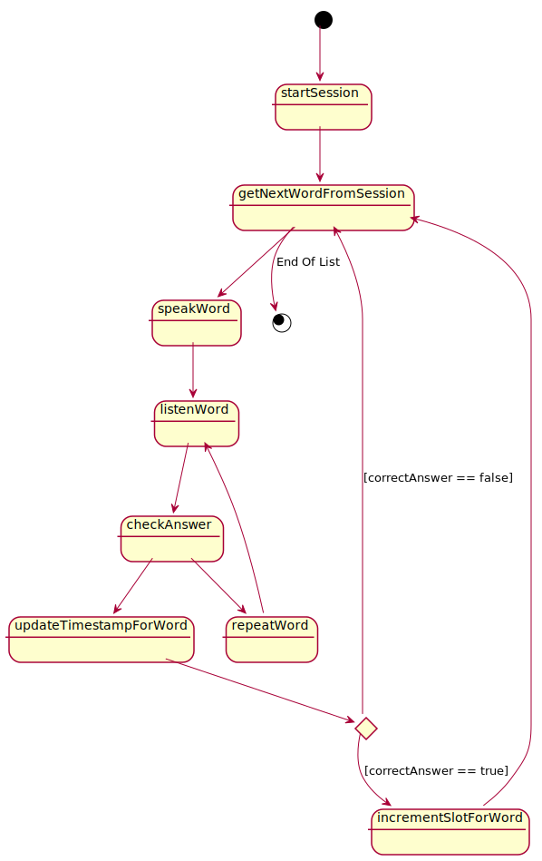

# DerDieDas

## Lerne deutsche Artikel überall 

<div hidden>

```
@startuml
[*] --> startSession
startSession --> getNextWordFromSession
getNextWordFromSession --> speakWord
getNextWordFromSession --> [*]: End Of List
speakWord --> listenWord
listenWord --> checkAnswer
listenWord --> repeatWord : [speechRecognitionError]
state a <<choice>> 
checkAnswer --> a 
a --> repeatWord : [isNoArticleFound || answerWordCount >= 5]
a --> updateTimestampForWord : [isArticleFound  &&  answerWordCount < 5]
state c <<choice>>
updateTimestampForWord --> c
c --> getNextWordFromSession : [isNotCorrectArticle]
c --> incrementSlotForWord : [isCorrectArticle]
repeatWord --> listenWord
incrementSlotForWord --> getNextWordFromSession
@enduml

```
</div>


